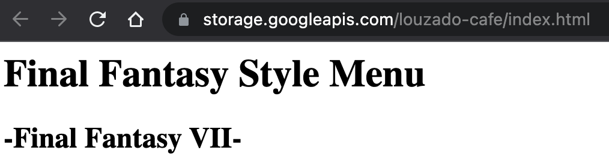
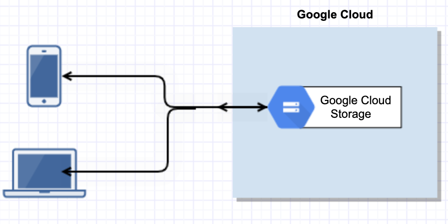
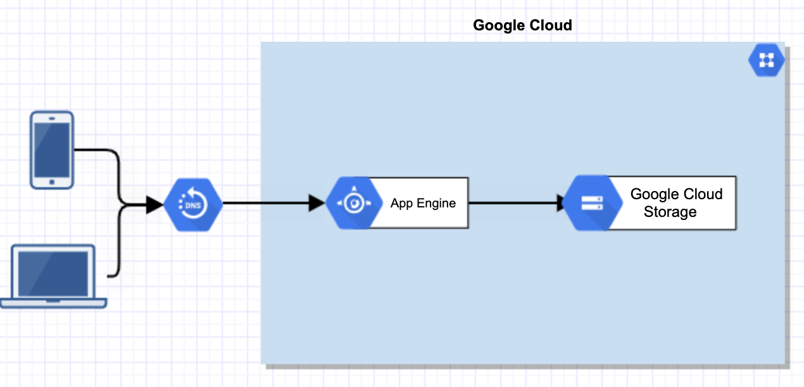

  

# **Task 1**

> Create and configure a web server on GCP.
Can be done anyway using the console, Google cloud SDK Terraform etc, preferably using a Linux distro OS with any preferred web server software (Apache, Nginx etc). Play this back to us, Talk us through what you did to get it working. What you struggle with, and what you did to overcome any challenges. What services and steps did you take? Share with ut the tutorials or resources you used for reference.

> Stretch goal - make it scalable!

## Getting it working

First, a Virtual Machine (VM) instance is needed running on Google Cloud. 
Go to'Compute Engine' and then 'VM Instances' where VMs can be created.
Click 'Create Instance' and configure the VM.
Ensure to enable 'http access' or add the 'http-server' tag under networking. Allows the web server to be viewable in a browser
I confirmed the instance is running by viewing the Instances area of VM Instances.

Next, install a web server on the VM using SSH.

After logging in, I run the following in the CLI

> sudo apt-get update
> sudo apt-get install apache2 -y
> sudo apache2 -v

SSH into the external IP to test the web server is running.

Additional steps would like to explore
- Using a non-default Service Account if this was a production environment. This currently uses the default compute engine service account.  

## Deploying using SDK

The above can be accomplished by using the CLI.

> gcloud config set compute/zone us-east1-a

Then run the following

> gcloud compute instances create "louzado-web-server1" \
> --machine-type "e2-micro" \
> --image-project "debian-cloud" \
> --image-family "debian-10" \
> --subnet "default"
> --tags=http-server

You will be prompted to authorize a call to the compute engine api
Confirm VM instance is running by

> gcloud compute instances describe louzado-web-server1

SSH into the VM

> gcloud compute ssh --zone "us-central1-a" "louzado-web-server1"  --project "project_id"
#project_id will need to enter actual project id

Install apache2

> sudo apt-get update #resync package index files from sources
> sudo apt-get install apache2 -y  #Install apache web server. -y for assume yes
> sudo apache2 -v #verify apache2 is installed.

Visit the site in the browser.

## Deploying using terraform

Folder - env-dev/task1

## Make it scalable (Optional)

To ensure my application has high availability, I will be scaling the application using managed instance groups and a load balancer.

To automate the installation of the web server on each instance, will run the below script on startup of the the VM with a custom welcome page. 
The landing page will be able to showcase both different stances being used and that the app can scale up or down.

         #! /bin/bash
         NAME=$(curl -H "Metadata-Flavor: Google" http://metadata.google.internal/computeMetadata/v1/instance/name)
         ZONE=$(curl -H "Metadata-Flavor: Google" http://metadata.google.internal/computeMetadata/v1/instance/zone | sed 's@.*/@@')
         sudo apt-get update
         sudo apt-get install -y stress apache2
         sudo systemctl start apache2
         cat <<EOF> /var/www/html/index.html
         <body style="font-family: sans-serif">
        <html><body><h1>Hi, My name is Will and this is my Web Server!</h1>
        
This machine is $NAME

        
Hosted in the $ZONE datacenter.

        

        </body></html>
         EOF

Would like to explore having the above instead in a rendered data template i.e. metadata_startup_script = data.template_file.init.rendered

Numbers 1-4 will be deployed via terraform with the Load Balancer and subsequent testing being done using the console as a live demo.

1) Create an Instance Template
2) Create an Instance Group
3) Create health checks
4) Firewall configuration
--------------------------
5) Create Load Balancer with a new backend
5) Verify instances are working by using load balancer external IP.
6) Stress test the application to ensure it scales out and in depending on load

Now that the load balancer is created I want to check each of the instances created are working by visiting the load balancer external IP.

Pick an instance to SSH into and run the following script
> stress --cpu 2 --io 1 --vm --vm-bytes 128M --timeout 30s

Refresh VM Instances to see if new VMs are being created as a result of stress. Visit external IPs and refresh to see if variable instance name and zone name changes.

## Additional Actions

Get load balancer set up using terraform
Learn to use variables and modules correctly in terraform
Use Custom Networks and replicate the above
Play around with IAM
Explore HTTPS options
Explore different load balancer options i.e Layer 4 like TCP

# **Task 2**

> We’d like you to investigate hosting a static content website on GCP using a service other than GCP Compute Engine. A design spike is an investigation piece of work where you try and come up with a proof of concept or a structured approach to solving a particular problem, task or issue. In this spike, we would like you to find 2 different ways of hosting a static content website in GCP using a service that is not GCP Compute engine. Document both methods and pick which method you would use, play this back to us why you would use this and why not the other method. You do not need to have this created and running to show us, just your documentation, thoughts and design on the 2 methods and why you picked 1 over the other.

Approach

1) Googling to understand key terms
2) Think of a basic use case with assumptions for the above
3) Think/Research GCP solutions that meet the need
4) Design/Sketch the solutions out
5) Pros/Cons of each solution
6) Decision and justification.

Static content is a file that remains constant every time it is served or delivered to users. For example, a menu for a restaurant or a blog.
A static website is composed of simple HTML, CSS, images or Javascript files, not php.

Assumptions

- Above is needed to showcase a basic web presence for proof of concept
- Scaling not needed as do not expect a lot of traffic for this demo but showcase a scalable scenario if traffic increases
- Static content is non-confidential and publicly available i.e. Menu, public blog
- Proof of concept only so no additional network/firewall configuration
- In all cases, a domain must be purchased to make visible. This can be done on Google Domains. 

## Option 1 - Cloud Storage Bucket

Host static files directly from a google cloud storage bucket

### Easy and very unsecure option for Proof of concept--

Create Storage Bucket
Set fine-grained access control
Upload HTML file
Make HTML file public
Visit Public URL of file

### Commercial proof of concept--

Pre-requisites

Familiarity with CNAME, A records and DNS
Domain name the business or individual owns or manages i.e. www.louzado-cafe.co.uk or www.creedthoughts.gov
(www.creedthoughts.gov.www\creedthoughts is not a domain)

Steps: 

1) Connect domain owned to Cloud Storage by creating a CNAME record that points to c.storage.googleapis.com
2) Verify ownership of the domain with Google.
3) Create storage bucket with the same name as the domain (For high availability, select a multi-regional zone and the location closes to the audience).
4) Upload static content to be hosted in the bucket.
5) Select the bucket and change the permissions, adding an allUsers member and setting the role of Storage Object Viewer.
6) Add a main index and 404 page i.e. index.html and 404.html using the settings icon on buckets.
7) Test the website URL in a browser

Diagram

## Option 2 App Engine

Interesting option - runs an app that mimics a server environment.
Allows you to code locally and develop apps using popular languages allowing good testing before deploying live.

Install Cloud SDK (google cloud CLI)
Setup a appengine project. Will have a app.yaml file and a folder structure containing all static content. i.e. folders for css, images etc aka the 'app'. Must include a landing page 'index.html
Configure the app.yaml file which will detail what static files to serve under conditions. Files can be deployed with the app or served from a Cloud Storage bucket
Test the app
Deploy the app

## Pros/Cons

### Cloud Storgae

Pros 

High availability and uses GCP Edge Network
Fine grained control of access to content using google cloud recommended security practices - IAM
Works as a content delivery network
Fast spin up from scratch

Cons

Single file at a time being served
Needs load balancer for HTTPS
More expensive than other Google Cloud options

### AppEngine

Pros 

Fully managed and serverless
Can just code then leave appengine to deploy and scale
Version control
Backend adding
Scales automatically
No domain needed but can map an existing one to the appengine project.
Advanced looging capability
Free tier with a set quota (Standard)

Cons

No out of the box
Need to install an SDK and be comfortable in a language
Preperation needed including set folder structure and app.yaml file configured correctly with handlers/url mapping

## Decision & Justification

It really depends on the use case. If the ideal output is to have a basic web presence with no further ambition other than to showcase a file or content, then Cloud Storage would be useful given it has a low spin up time , high availability and fine grained control of the files by use of Google Cloud IAM.

However for a more productionised solution which follows a traditional development lifecycle including version control, testing and advanced login with a fully managed servless infrastructure then I would personally go for appengine. With the right configuration, it could also end up being a zero financial cost per month and allows the website to automatically scale if there is a spike in traffic. Once the initial configuration is out of the way (which would be a learning curve) you then have a template and file structure which offers a higher level of customisation and usability with other google cloud services.